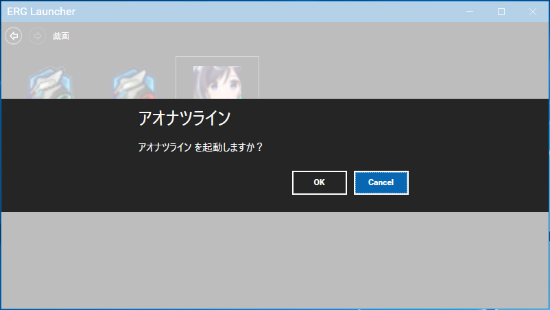

# ERGLauncher

[English](README.md) | [日本語](README.ja.md)


ERG Launcherは、ブランドごとにゲームを管理するランチャーアプリケーションです。



## 検証

リポジトリルートから正規のMTP/TUnit検証を実行します:

```sh
tools/verify-tests.sh
```

実行ごとに、無視対象のワークスペースローカルなエビデンスディレクトリ `qa-artifacts/verification/tests-<timestamp>-<unique-suffix>/` が作成および保持されます。リストアの前に、スクリプトはその実行ディレクトリ配下に `TMPDIR`、`TEMP`、`TMP`、`NUGET_PACKAGES`、`NUGET_HTTP_CACHE_PATH`、および `DOTNET_CLI_HOME` を設定します。MTPはその `TestResults/` ディレクトリに結果を出力します。これは隔離のために、実行ごとに新しいNuGetパッケージキャッシュおよびHTTPキャッシュを意図的に使用します。完了したエビデンスは保持されます。個々の実行ディレクトリは、不要になった場合にのみ手動で削除してください。その後、スクリプトは1つのワークスペース内で常に以下の手順を実行します:

```sh
dotnet restore ERGLauncher.sln
dotnet build ERGLauncher.sln -c Release --no-restore --warnaserror
dotnet test ERGLauncher.sln -c Release --no-build --results-directory <run>/TestResults
```

`--no-build` は意図的に最終ステップとされており、独立した合否判定コマンドではありません。Microsoft Testing Platform/TUnitには、先行するビルドによって生成された、対応するReleaseランナー実行可能ファイルが必要です。単独の `--no-build` 実行によるテスト数ゼロまたは非ゼロの結果は、TUnit/MTPパッケージ、`global.json`、プロジェクトファイル、または `Directory.Build.props` を変更する理由には**なりません**。このワークフローは実行順序を固定するのみです。

### 設定スモークフィクスチャ規約

`--settings-smoke <base-directory>` は、それらの設定を変更する前に、**既存の**レガシー設定との互換性を確認します。これには `<base-directory>/settings/appSettings.json` と、空ではない `<base-directory>/settings/gameSettings.json` が必要です。したがって、空のディレクトリで失敗するのは意図的な挙動です。スモークコマンドはデフォルト値を初期化しません。

ユーザー設定ディレクトリを指定したり、チェックインされたフィクスチャを変更したりする代わりに、サポートされている段階的な実行を使用してください:

```sh
tools/run-settings-smoke.sh
```

スクリプトは追跡対象のレガシーフィクスチャを新しい `qa-artifacts/verification/settings-smoke-<timestamp>-<unique-suffix>/settings/` ディレクトリにコピーし、.NETを呼び出す前に、その実行ルート配下に `TMPDIR`、`TEMP`、`TMP`、`NUGET_PACKAGES`、`NUGET_HTTP_CACHE_PATH`、および `DOTNET_CLI_HOME` を設定します（これは一貫した成果物レイアウトのために `TestResults/` も確保します）。ステージングされたコピーはCRUDおよび永続化チェック中に変更される可能性がありますが、追跡対象のフィクスチャはハッシュチェックされ、変更されないまま維持されます。どちらのQAラッパーも排他的なワークスペースローカルの実行ルートを割り当てるため、同時実行や間断のない連続実行を行っても、ステージングされたフィクスチャ、ログ、一時ディレクトリ、NuGetキャッシュ、`DOTNET_CLI_HOME`、または `TestResults` が共有されることはありません。いずれのラッパーも過去のエビデンスを削除しません。完了した実行ディレクトリは、不要になった場合にのみ手動で削除してください。

## 作成者

[@zwei_222](https://twitter.com/zwei_222/)
