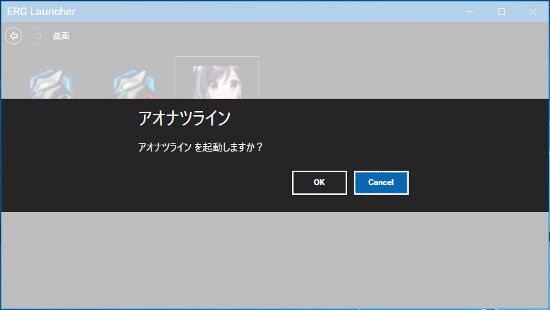

# ERGLauncher

ERG Launcher is a launcher application that manages games by brand.



## Verification

Run the canonical MTP/TUnit verification from the repository root:

```sh
tools/verify-tests.sh
```

Each invocation creates and retains an ignored workspace-local evidence directory:
`qa-artifacts/verification/tests-<timestamp>-<unique-suffix>/`. Before restore, the script sets
`TMPDIR`, `TEMP`, `TMP`, `NUGET_PACKAGES`, `NUGET_HTTP_CACHE_PATH`, and
`DOTNET_CLI_HOME` below that run directory; MTP writes results to its
`TestResults/` directory. This intentionally uses fresh per-run NuGet package and
HTTP caches for isolation. Completed evidence is retained; remove individual run
directories manually only when they are no longer needed. The script then always runs this sequence
in one workspace:

```sh
dotnet restore ERGLauncher.sln
dotnet build ERGLauncher.sln -c Release --no-restore --warnaserror
dotnet test ERGLauncher.sln -c Release --no-build --results-directory <run>/TestResults
```

`--no-build` is deliberately the final step, not an independent acceptance
command: Microsoft Testing Platform/TUnit requires the matching Release runner
executables generated by the preceding build. A zero-test/nonzero result from a
bare `--no-build` invocation does **not** justify changing TUnit/MTP packages,
`global.json`, project files, or `Directory.Build.props`; this workflow fixes
execution order only.

### Settings smoke fixture contract

`--settings-smoke <base-directory>` checks compatibility with **existing**
legacy settings before it mutates those settings. It requires
`<base-directory>/settings/appSettings.json` and a non-empty
`<base-directory>/settings/gameSettings.json`. Therefore an empty directory
failing is intentional: the smoke command does not initialize defaults.

Use the supported staged invocation instead of supplying a user settings
directory or modifying checked-in fixtures:

```sh
tools/run-settings-smoke.sh
```

The script copies the tracked legacy fixtures into a new
`qa-artifacts/verification/settings-smoke-<timestamp>-<unique-suffix>/settings/` directory and,
before invoking .NET, sets `TMPDIR`, `TEMP`, `TMP`, `NUGET_PACKAGES`,
`NUGET_HTTP_CACHE_PATH`, and `DOTNET_CLI_HOME` below that run root (which also
reserves `TestResults/` for a consistent artifact layout). The staged copies may
change during CRUD and persistence checks; the tracked fixtures are hash-checked
and remain unchanged. Both QA wrappers allocate exclusive workspace-local run
roots, so concurrent or rapid consecutive invocations do not share staged fixtures,
logs, temporary directories, NuGet caches, `DOTNET_CLI_HOME`, or `TestResults`.
Neither wrapper deletes prior evidence; remove completed run directories manually
only when they are no longer needed.

## Author

[@zwei_222](https://twitter.com/zwei_222/)
